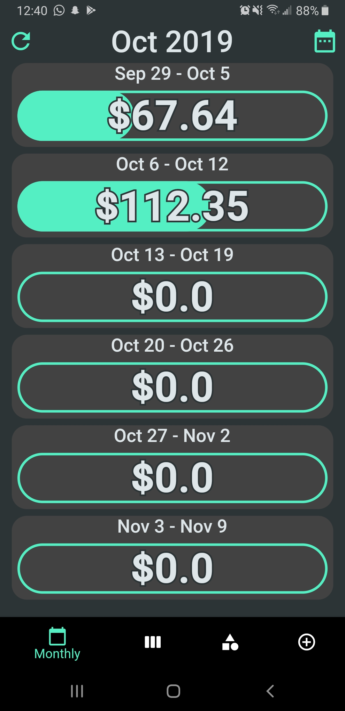
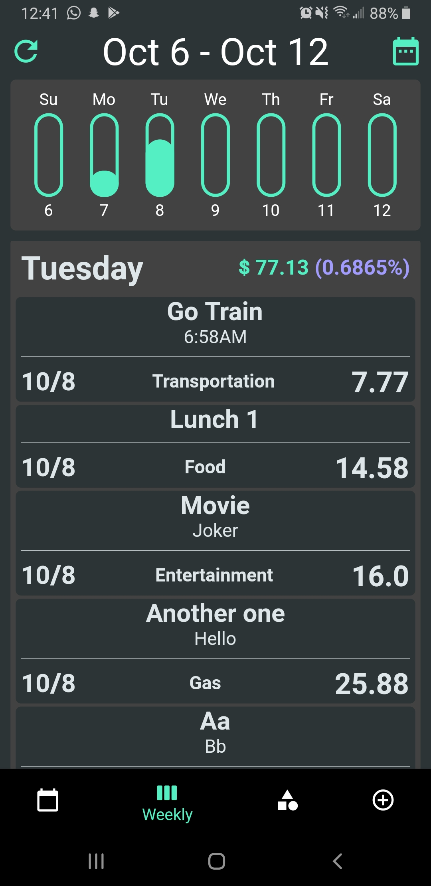
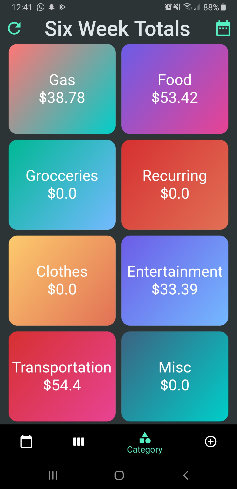
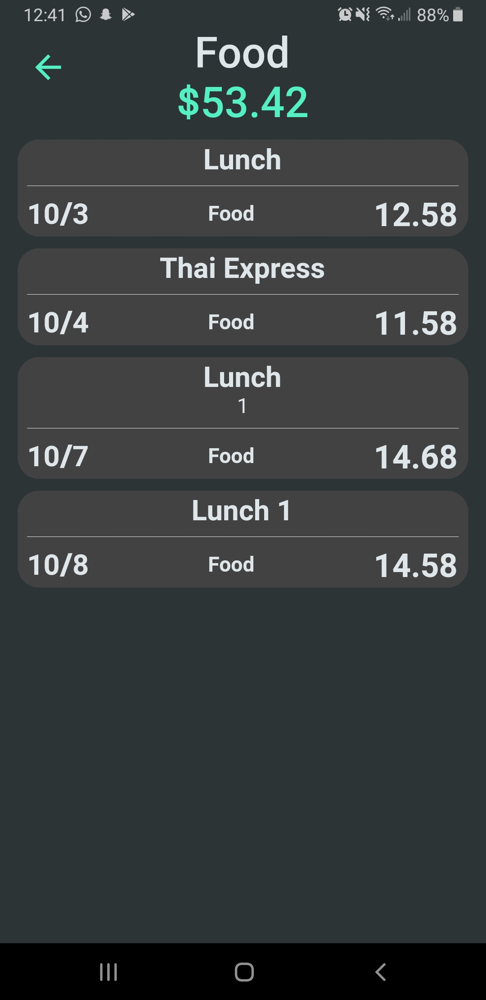
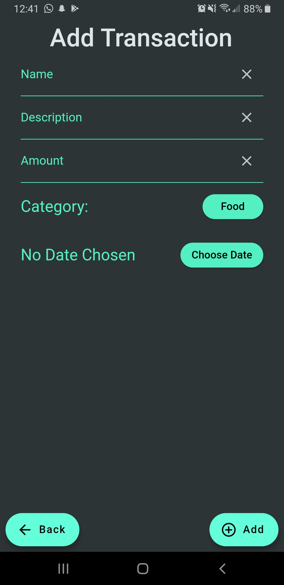
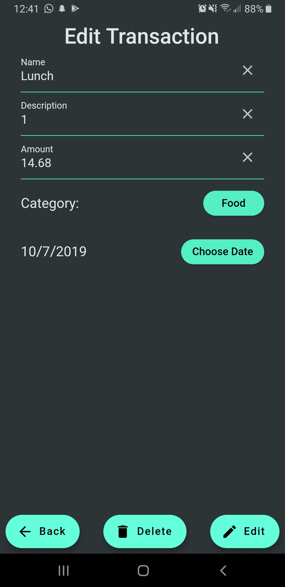

# Spending Tracker (Deprecated)

## About

This is an app built to help people track their monthly spending. In the monthly view, you can see the entire month (6 weeks) split weekly. Clicking on any week will open and display the weekly spending view with a list of transactions at the bottom. There is also a category view where users can view the entire six weeks categorically. Clicking on a category will allow users to view all the transactions for that category in that six weeks.

**This is an old deprecated version of spending tracker. There will be no more revisions made to this app.**

## Data Storage

Currently using SQFLite to store the transaction as one big table of transactions and then performing a query search for any transactions between dates (dates are stored as milliseconds since epoch). Currently, only supporting adding to the database and querying the database.

## Screenshots

### Main screen

> This screen shows six weeks starting from the beginning of the month to the last of the month. Users can click on each card to go the weekly view.

### Weekly screen

> This screen shows the seven days of the week on a bar graph with the transactions that occured on each day at the bottom the screen. Each day also shoes the amount spent that day and the daily percentage of that take (Daily Percentage = DailyTotal/WeeklyTotal).

### Category Screen

> This screen shows all eight preset categories which allows users to click to show the current category screen.

### Current Category Screen

> This screen shows all transactions for a particular category that has been added by the user for the selected month.

### Add Transaction

### Edit Transaction

